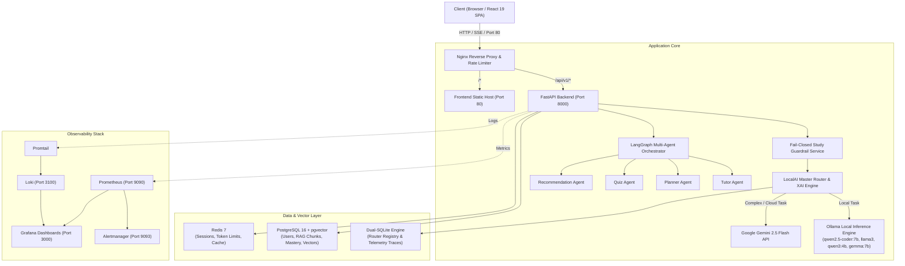

# 🎓 PaathShala AI (पाठशाला)

<div align="center">

[](https://python.org)
[](https://fastapi.tiangolo.com)
[](https://react.dev)
[](https://typescriptlang.org)
[](https://github.com/pgvector/pgvector)
[](https://docker.com)
[](https://kubernetes.io)
[](https://prometheus.io)
[](LICENSE)

**An Enterprise-Grade Agentic Adaptive Learning Platform & Intelligent Local/Cloud AI Gateway**

*Empowering learners through continuous knowledge tracing, cognitive retention modeling, and dynamic edge/cloud LLM routing.*

[Key Features](#-key-features) • [System Architecture](#-system-architecture) • [Model Router](#-intelligent-localcloud-model-router) • [Adaptive Learning Core](#-adaptive-learning-core) • [Quickstart](#-quickstart--installation) • [API Reference](#-api-endpoints) • [Master Guide (everything.md)](everything.md)

</div>

---

## 📌 Overview

**PaathShala AI** is a full-stack, enterprise-grade AI learning platform designed to overcome the critical pitfalls of modern EdTech applications:
1. **Monolithic Prompting:** Instead of one massive prompt to a generic cloud LLM, PaathShala orchestrates specialized agents (Tutor, Planner, Quiz, Research, Recommendation) via a stateful **LangGraph** supervisor pattern.
2. **API Cost Explosions:** Employs an autonomous **LocalAI Master Router** that dynamically routes queries between open-weights local models (`Ollama`) and frontier cloud models (`Google Gemini 2.5 Flash`), achieving **66.7% local compute offloading**.
3. **Absence of Real Knowledge Tracing:** Models live student knowledge states using continuous **Elo Mastery Tracking** and **Item Response Theory (IRT Rasch 1-PL)** difficulty calibration.
4. **Cognitive Retention:** Incorporates the **SuperMemo-2 (SM-2)** algorithm fused with **Ebbinghaus exponential forgetting curves** ($R = e^{-\lambda \Delta t}$) to automatically identify weak topics and schedule proactive reviews.
5. **Safety & Guardrails:** Enforces sub-millisecond fail-closed educational regex guardrails that prevent prompt injection, system prompt extraction, and non-academic queries.

---

## 🚀 Key Features

- **🤖 Multi-Agent Orchestration (LangGraph):**
  - **Supervisor Agent:** Dynamically analyzes user intents, decomposes tasks, and delegates to specialized sub-agents.
  - **Tutor Agent:** Socratic dialog, grounded explanations, and prerequisite-aware learning.
  - **Planner Agent:** Creates personalized, structured milestone-based study roadmaps.
  - **Quiz Agent:** Generates tailored MCQs, conceptual challenges, and adaptive assessments.
  - **Recommendation Agent:** Suggests high-priority review topics based on memory and mastery gaps.

- **⚡ Autonomous Local/Cloud Model Gateway:**
  - **Local Models (Ollama):** `qwen2.5-coder:7b`, `llama3:latest`, `qwen3:4b`, `gemma:7b`.
  - **Frontier Cloud:** `gemini-2.5-flash` with exponential backoff retry resilience.
  - **Zero-Lock-Contention Dual-SQLite Registry:** Read-heavy model routing and metrics decoupled from write-heavy telemetry.
  - **Explainable AI (XAI):** Real-time scoring breakdown across Capability, Benchmark Accuracy, Speed (tokens/sec), and Hardware Resource Availability.
  - **Decision Latency:** Sub-$5\text{ ms}$ routing decision overhead.

- **🧠 Adaptive Mastery & Cognitive Retention Engine:**
  - **Dynamic Elo Rating:** Updates live after every quiz ($K=32$) and chat interaction ($K=150$).
  - **IRT Rasch 1-PL Calibration:** Computes empirical question difficulty $b = -\text{logit}(p)$.
  - **SM-2 Spaced Repetition + Forgetting Curve:** Calculates retrievability with a 45% floor to surface overdue review concepts into the chat UI.

- **📚 Semantic RAG & Vector Memory:**
  - Ingests PDFs, Markdown, and TXT files using PyMuPDF and LangChain recursive chunkers.
  - 768-dimensional embeddings generated with Google `text-embedding-004`.
  - Stored in **PostgreSQL with `pgvector`** for cosine similarity semantic search (`<=>`).
  - 3-tier memory hierarchy: Long-term profile memory, concept mastery memory, and episodic conversation memory.

- **🛡️ Fail-Closed Educational Guardrails:**
  - Microsecond-level input validation rejecting prompt extraction, malicious injections, and off-topic entertainment requests with HTTP 422.

- **📈 Enterprise Observability & MLOps:**
  - End-to-end monitoring with **Prometheus**, **Grafana**, **Loki**, **Promtail**, and **Alertmanager**.
  - Production-ready **Kubernetes (k8s)** manifests and **Terraform** infrastructure definitions.

---

## 🏗️ System Architecture



---

## 🧠 Adaptive Learning Core

PaathShala AI replaces static grading with mathematical cognitive models:

### 1. Elo Skill & Mastery Adjustment
Each student and topic has an evolving Elo rating ($R$). After an assessment outcome $S \in \{0, 1\}$ against an item with difficulty rating $R_{\text{item}}$:
$$E = \frac{1}{1 + 10^{(R_{\text{item}} - R_{\text{student}}) / 400}}$$
$$R'_{\text{student}} = R_{\text{student}} + K \cdot (S - E)$$
*(Where $K = 32$ for standardized quizzes, $K = 150$ for interactive Socratic turns).*

### 2. Item Response Theory (IRT Rasch 1-PL)
Question difficulties are dynamically calibrated from empirical learner pass-rates ($p$):
$$P(X=1 \mid \theta, b) = \frac{1}{1 + e^{-(\theta - b)}} \quad \implies \quad b = -\ln\left(\frac{p}{1 - p}\right)$$

### 3. SuperMemo-2 (SM-2) with Ebbinghaus Decay
Spaced-repetition review intervals ($I$) and ease factors ($EF$) evolve with student responses:
$$EF' = EF + (0.1 - (5 - q) \cdot (0.08 + (5 - q) \cdot 0.02))$$
Retrievability decay over elapsed time $\Delta t$:
$$R(t) = \max\left(e^{-\lambda \cdot \Delta t},\; 0.45\right)$$
Topics with $R(t) < 0.60$ trigger automatic **"Due for Review"** chips in the student dashboard.

---

## 🔀 Intelligent Local/Cloud Model Router

The autonomous model gateway optimizes for **cost**, **quality**, and **latency**:

| Model | Host | Parameter Size | Primary Purpose | Cost / 1M Tokens |
|---|---|---|---|---|
| **`qwen2.5-coder:7b`** | Local (Ollama) | 7.6B | Code analysis, syntax checks, programming tasks | **$0.00** |
| **`llama3:latest`** | Local (Ollama) | 8.0B | General tutoring, conceptual explanations | **$0.00** |
| **`qwen3:4b`** | Local (Ollama) | 4.0B | Fast keyword routing, intent classification | **$0.00** |
| **`gemma:7b`** | Local (Ollama) | 8.5B | High-precision quiz generation | **$0.00** |
| **`gemini-2.5-flash`** | Cloud (Google AI) | Frontier MoE | Complex RAG synthesis, multi-step roadmaps | Cloud API Rate |

### Explainable AI (XAI) Scoring Equation:
$$\text{Score} = w_1 \cdot \text{Capability} + w_2 \cdot \text{Benchmark} + w_3 \cdot \text{Throughput} + w_4 \cdot \text{HardwareAvailability}$$
Decisions are transparently logged with percentage contributions to guarantee auditability for SREs.

---

## 💻 Tech Stack

| Category | Technology |
|---|---|
| **Backend Framework** | [FastAPI](https://fastapi.tiangolo.com) (Python 3.11+, Async, Pydantic v2, SQLAlchemy 2) |
| **Agent Framework** | [LangGraph](https://github.com/langchain-ai/langgraph) / LangChain Core |
| **Database & Vector** | [PostgreSQL 16](https://www.postgresql.org) with [pgvector](https://github.com/pgvector/pgvector) & Dual SQLite |
| **Caching & Queues** | [Redis 7](https://redis.io) |
| **Cloud LLMs** | [Google Gemini 2.5 Flash](https://ai.google.dev), `text-embedding-004` |
| **Local LLMs** | [Ollama](https://ollama.ai) (`qwen2.5-coder:7b`, `llama3`, `qwen3:4b`, `gemma:7b`) |
| **Frontend Framework** | [React 19](https://react.dev), [Vite 8](https://vite.dev), [TypeScript 5](https://www.typescriptlang.org) |
| **Styling & Motion** | [TailwindCSS v4](https://tailwindcss.com), [Framer Motion](https://www.framer.com/motion), [Three.js](https://threejs.org) |
| **State Management** | [Zustand](https://github.com/pmndrs/zustand) |
| **Container & Orchestration** | [Docker](https://www.docker.com), [Docker Compose](https://docs.docker.com/compose), [Kubernetes](https://kubernetes.io) |
| **Reverse Proxy** | [Nginx](https://nginx.org) (Rate limiting, JSON access logs, reverse proxying) |
| **Monitoring & Logs** | [Prometheus](https://prometheus.io), [Grafana](https://grafana.com), [Loki](https://grafana.com/oss/loki), [Promtail](https://grafana.com/docs/loki/latest/clients/promtail), [Alertmanager](https://prometheus.io/docs/alerting/latest/alertmanager) |
| **IaC** | [Terraform](https://www.terraform.io) |

---

## 📁 Repository Structure

```text
PaathShala-ai/
├── backend/                        # FastAPI Core Application
│   ├── app/
│   │   ├── ai/                     # LangGraph agents, prompt templates, LLM providers
│   │   │   ├── agents/             # Tutor, Planner, Quiz agents
│   │   │   ├── prompts/            # Pedagogical system prompts
│   │   │   └── providers/          # Gemini & Local Ollama providers
│   │   ├── api/                    # Versioned REST API endpoints (v1)
│   │   │   └── routes/             # Auth, Chat, Agent, Quizzes, Documents, Health
│   │   ├── core/                   # Security, JWT, Configuration & Settings
│   │   ├── database/               # SQLAlchemy models, Alembic migrations, pgvector schemas
│   │   └── services/               # Guardrails, RAG ingestion, Spaced Repetition, Elo/IRT
│   ├── tests/                      # Pytest unit & integration test suites
│   ├── requirements.txt            # Python dependencies
│   └── Dockerfile                  # Container definition for backend
├── frontend/                       # React 19 + TypeScript SPA
│   ├── src/
│   │   ├── api/                    # Axios clients & SSE streaming connectors
│   │   ├── components/             # Reusable UI components (Chat, Quiz, 3D, Spaced Repetition)
│   │   ├── pages/                  # Dashboard, AIChat, AgentChat, Quizzes, Progress
│   │   └── store/                  # Zustand global application state
│   ├── package.json
│   └── Dockerfile                  # Production multi-stage Nginx container
├── monitoring/                     # Full observability stack
│   ├── prometheus/                 # Prometheus scrape configs & alerting rules
│   ├── grafana/                    # Automated datasource provisioning & dashboards
│   ├── loki/                       # Log aggregation service configs
│   └── alertmanager/               # Alert routing & webhook notification rules
├── nginx/                          # Production Nginx reverse proxy & rate limiter configs
├── k8s/                            # Production Kubernetes Deployment & Service manifests
├── terraform/                      # Cloud infrastructure as code
├── docker-compose.yml              # Complete one-command containerized stack
├── Makefile                        # Automation shortcuts (build, up, down)
├── everything.md                   # 600+ line Master Production Architecture & Interview Guide
└── README.md                       # Main project documentation
```

---

## ⚡ Quickstart & Installation

### Option 1: One-Click Docker Compose (Recommended)

Make sure you have [Docker](https://docs.docker.com/get-docker/) and [Docker Compose](https://docs.docker.com/compose/install/) installed.

1. **Clone the repository:**
   ```bash
   git clone https://github.com/jayant733/PaathShala-ai.git
   cd PaathShala-ai
   ```

2. **Configure Environment Variables:**
   ```bash
   cp backend/.env.example backend/.env
   ```
   Add your Google Gemini API key to `backend/.env`:
   ```env
   GEMINI_API_KEY=your_gemini_api_key_here
   ```

3. **Launch the entire stack:**
   ```bash
   make up
   # or
   docker compose up --build -d
   ```

4. **Access the Services:**
   - 🌐 **Web Application:** [http://localhost](http://localhost) (or [http://localhost:8080](http://localhost:8080))
   - 🔌 **API Documentation (Swagger):** [http://localhost:8000/docs](http://localhost:8000/docs)
   - 📊 **Grafana Observability:** [http://localhost:3000](http://localhost:3000) *(User: `admin`, Pass: `admin`)*
   - 📈 **Prometheus Metrics:** [http://localhost:9090](http://localhost:9090)
   - 🚨 **Alertmanager:** [http://localhost:9093](http://localhost:9093)

---

### Option 2: Local Development Setup

#### Backend Setup
```bash
cd backend
python -m venv venv

# Windows:
.\venv\Scripts\activate
# Linux/macOS:
source venv/bin/activate

pip install -r requirements.txt
cp .env.example .env

# Run migrations & start FastAPI
uvicorn app.main:app --reload --port 8000
```

#### Frontend Setup
```bash
cd frontend
npm install
npm run dev
# Vite runs at http://localhost:5173
```

---

## 📡 API Endpoints

### Authentication & Users
- `POST /api/v1/auth/register` — Create a new account with hashed credentials.
- `POST /api/v1/auth/login` — Authenticate and receive a JWT access token.
- `GET /api/v1/users/me` — Retrieve the current user's profile and learning statistics.

### Multi-Agent & AI Interaction
- `POST /api/v1/agent/chat` — Synchronous chat with the LangGraph supervisor and sub-agents.
- `POST /api/v1/agent/stream` — Real-time Server-Sent Events (SSE) streaming chat.
- `POST /api/v1/ai/chat` — Direct interaction with the Socratic AI Tutor.

### Document Ingestion & RAG
- `POST /api/v1/documents/upload` — Upload PDF/TXT/MD, extract text, chunk, and embed into `pgvector`.
- `POST /api/v1/documents/{id}/ask` — Semantic retrieval question answering grounded in document context.

### Quizzes & Mastery Tracking
- `POST /api/v1/quizzes/generate` — Generate adaptive practice questions.
- `POST /api/v1/quizzes/{id}/submit` — Grade quiz and update student Elo & IRT difficulty ratings.
- `GET /api/v1/progress/spaced-repetition` — Fetch concepts due for SM-2 review.

---

## 🧪 Testing & Verification

Run the comprehensive unit and integration test suites:

```bash
cd backend
# Run all tests
pytest

# Test the Fail-Closed Study Guardrail
pytest tests/unit/test_study_guardrail.py -v

# Test Multi-Agent Orchestration & AI Routes
pytest tests/test_ai.py -v
```

---

## 📖 Deep-Dive Architecture Guide

For an in-depth 600+ line master breakdown of:
- Exact benchmark metrics & token savings proof ($66.7\%$ local offload)
- Mathematical derivations for Elo, IRT Rasch 1-PL, and Ebbinghaus curves
- Dual-SQLite lock contention solutions
- Technical interview questions and architectural tradeoffs

👉 **Read the [PaathShala AI Master Guide (`everything.md`)](everything.md)**

---

## 🤝 Contributing

1. Fork the Project
2. Create your Feature Branch (`git checkout -b feature/AmazingFeature`)
3. Commit your Changes (`git commit -m 'feat: Add some AmazingFeature'`)
4. Push to the Branch (`git push origin feature/AmazingFeature`)
5. Open a Pull Request

---

## 📄 License

Distributed under the **MIT License**. See `LICENSE` for more information.

<div align="center">
  <sub>Built with ❤️ by the PaathShala AI Engineering Team</sub>
</div>
